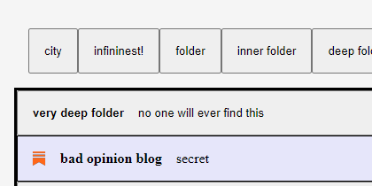
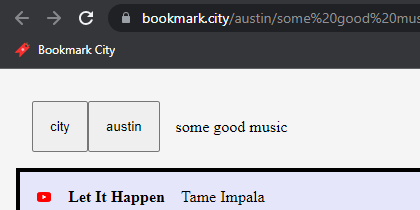

# Bookmark City
The lightning fast bookmark manager where anyone can make a web directory for all to use. Make playlists that link to music from different sites, wish lists that link to products from different stores, or literally anything else you can think of. Explore the city [here](https://bookmark.city/).

&nbsp;

&nbsp;
## features
* ### explore

You don't need an account to browse everyone's collections.

&nbsp;
* ### make

You can start your own collection in three clicks, or one if you like using your tab key. Adding bookmarks is just as simple.

&nbsp;
* ### organize (fun!)

Create folders. Nest them as deeply as you want. Click and drag anything to anywhere, including to or from your browser's bookmarks bar. The optimistic UI will never make you wait.

&nbsp;
* ### share

Every collection and folder, like [this one](https://bookmark.city/austin/some%20good%20music), has its own web address for easy sharing. You could even save links to other collections as bookmarks in your own collection.

&nbsp;
## tech stack
* JavaScript
* React
* Custom global state management that's better than Redux
* Custom dynamic routing that's better than React Router
* NodeJs
* Express
* Amazon RDS via PostgreSQL via Sequelize ORM, but should have used DynamoDB
* Bcrypt
* JSON Web Token
* Amazon EC2
* Amazon Route 53
* CSS
* HTML5
* axios